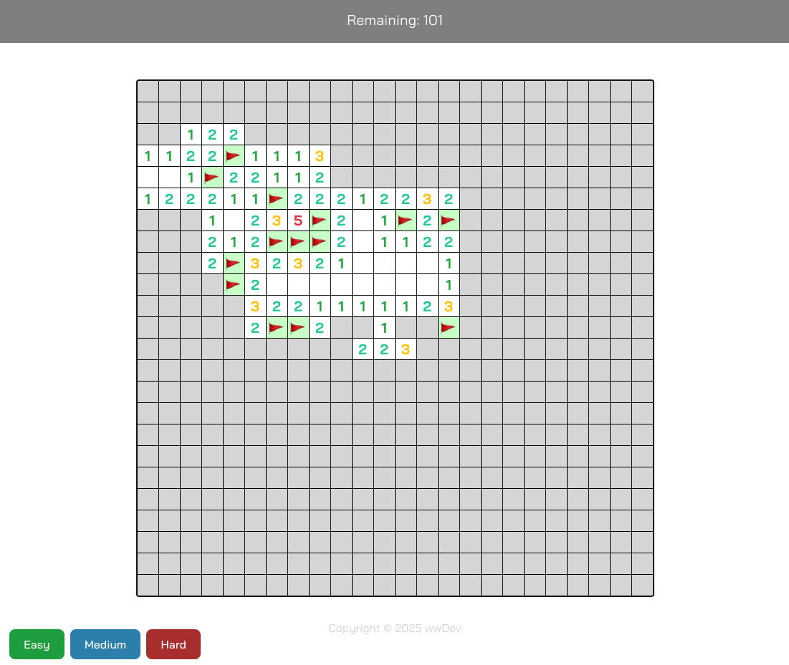

# Minesweeper Online 💣 🚩

This project is built using Vite + Svelte + TypeScript | [Play](https://minesweeper-azure-one.vercel.app/)

## How to Play

Minesweeper is a classic puzzle game where you clear a rectangular board containing hidden "mines" or bombs without detonating any of them. The goal is to clear the board by revealing all non-mine squares.

### On Desktop

- <ins>Left-click</ins> on an unrevealed square: To open the square. If it's a mine, the game is over! If it's not a mine, it will reveal a number indicating how many mines are adjacent to it (in the 8 surrounding squares).

- <ins>Right-click</ins> on an unrevealed square: To place a flag on the square. This marks it as a suspected mine. Right-click again to remove the flag.

- <ins>Left-click</ins> on a numbered, revealed square: To open adjacent squares. This action is only recommended when you are certain all adjacent mines have been correctly flagged. If the number of flags around the revealed square matches the number displayed on it, clicking will open all unflagged adjacent squares. Be careful, as opening an incorrect square can trigger a mine!

- <ins>Right-click</ins> on a numbered, revealed square: To flag adjacent squares. This action will attempt to place flags on unrevealed squares around the clicked cell, specifically on squares where it can deduce a mine should be, given the number of adjacent mines and already revealed cells.

### On Mobile

- <ins>Tap</ins> on an unrevealed square: To open the square. Similar to a left-click on desktop.

- <ins>Long-press</ins> on an unrevealed square: To place a flag on the square. Similar to a right-click on desktop.

- <ins>Tap</ins> on a numbered, revealed square: To open adjacent squares. Similar to a left-click on a numbered square on desktop.

- <ins>Long-press</ins> on a numbered, revealed square: To flag adjacent squares. Similar to a right-click on a numbered square on desktop.

### Thank you for reading!

---

## เกมกู้ระเบิด 💣 🚩

โปรเจกต์นี้ถูกสร้างขึ้นด้วยการใช้ Vite, Svelte และ TypeScrip | [เล่นเลย](https://minesweeper-azure-one.vercel.app/)

## วิธีเล่น

Minesweeper เป็นเกมพัซเซิลคลาสสิกที่คุณต้องเคลียร์ตารางสี่เหลี่ยมที่มี "ระเบิด" หรือทุ่นระเบิดซ่อนอยู่ โดยไม่ให้ระเบิดใดๆ ทำงาน เป้าหมายคือการเคลียร์ตารางให้หมด โดยเปิดเผยช่องที่ไม่ใช่ระเบิดทั้งหมด

### บนคอมพิวเตอร์

- <ins>คลิกซ้าย</ins> ที่ช่องที่ยังไม่เปิด: เพื่อ เปิด ช่อง หากเป็นระเบิด เกมจะจบลง! หากไม่ใช่ระเบิด จะแสดงตัวเลขที่ระบุจำนวนระเบิดที่อยู่ติดกัน (ใน 8 ช่องรอบๆ)

- <ins>คลิกขวา</ins> ที่ช่องที่ยังไม่เปิด: เพื่อ ปักธง ลงบนช่อง ใช้เพื่อทำเครื่องหมายว่าสงสัยว่าเป็นระเบิด คลิกขวาอีกครั้งเพื่อเอาธงออก

- <ins>คลิกซ้าย</ins> ที่ช่องที่เปิดแล้วและมีตัวเลข: เพื่อ เปิดช่องรอบๆ การกระทำนี้แนะนำเมื่อคุณแน่ใจว่าได้ปักธงระเบิดที่อยู่ติดกันทั้งหมดถูกต้องแล้ว หากจำนวนธงรอบๆ ช่องที่เปิดแล้วตรงกับตัวเลขที่แสดงอยู่ การคลิกจะเปิดช่องที่อยู่ติดกันที่ไม่ได้ปักธงทั้งหมด ระวังให้ดี เพราะการเปิดช่องผิดอาจทำให้ระเบิดทำงานได้!

- <ins>คลิกขวา</ins> ที่ช่องที่เปิดแล้วและมีตัวเลข: เพื่อ ปักธงช่องรอบๆ การกระทำนี้จะพยายามปักธงบนช่องที่ยังไม่เปิดรอบๆ ช่องที่คลิก โดยเฉพาะช่องที่สามารถอนุมานได้ว่า ควรจะมีระเบิด เมื่อพิจารณาจากจำนวนระเบิดที่อยู่ติดกันและช่องที่เปิดเผยแล้ว

### บนมือถือ

- <ins>แตะ</ins> ที่ช่องที่ยังไม่เปิด: เพื่อ เปิด ช่อง หากเป็นระเบิด เกมจะจบลง! หากไม่ใช่ระเบิด จะแสดงตัวเลขที่ระบุจำนวนระเบิดที่อยู่ติดกัน (ใน 8 ช่องรอบๆ)

- <ins>กดค้าง</ins> ที่ช่องที่ยังไม่เปิด: เพื่อ ปักธง ลงบนช่อง ใช้เพื่อทำเครื่องหมายว่าสงสัยว่าเป็นระเบิด กดค้างอีกครั้งเพื่อเอาธงออก

- <ins>แตะ</ins> ที่ช่องที่เปิดแล้วและมีตัวเลข: เพื่อ เปิดช่องรอบๆ การกระทำนี้แนะนำเมื่อคุณแน่ใจว่าได้ปักธงระเบิดที่อยู่ติดกันทั้งหมดถูกต้องแล้ว หากจำนวนธงรอบๆ ช่องที่เปิดแล้วตรงกับตัวเลขที่แสดงอยู่ การคลิกจะเปิดช่องที่อยู่ติดกันที่ไม่ได้ปักธงทั้งหมด ระวังให้ดี เพราะการเปิดช่องผิดอาจทำให้ระเบิดทำงานได้!

- <ins>กดค้าง</ins> ที่ช่องที่เปิดแล้วและมีตัวเลข: เพื่อ ปักธงช่องรอบๆ การกระทำนี้จะพยายามปักธงบนช่องที่ยังไม่เปิดรอบๆ ช่องที่คลิก โดยเฉพาะช่องที่สามารถอนุมานได้ว่า ควรจะมีระเบิด เมื่อพิจารณาจากจำนวนระเบิดที่อยู่ติดกันและช่องที่เปิดเผยแล้ว

### ความคิดเห็น

ความจริงถนัด React กับ Next มากที่สุด แต่อยากลองใช้อะไรที่แตกต่างไปบ้าง ตอนแรกคิดว่าจะใช้ Vue 3 แต่ก็รู้สึกว่าเคยใช้มาเยอะเหมือนกัน สุดท้ายเลยมาตกที่ Svelte เพราะเคยใช้ทำแค่โปรเจ็คเดียว

เคยลองใช้ Svelte เมื่อประมาณ 3 ปีก่อน ตอนที่ยังไม่มี runes พอมาเขียนตอนนี้รู้สึกเหมือนเขียนคล้าย ๆ เดิม ไม่ค่อยต่างกันเท่าไร แต่รู้สึกชอบ Conditional Rendering ของ Svelte มากกว่า React รู้สึกอ่านง่ายกว่า แต่ข้อเสียก็คือไม่ได้เป็น Pure JavaScript แบบ React (ใช้ Ternary Operator)

โปรเจ็คนี้เน้นสร้างเพื่อเอามาเล่นขำ ๆ เลยไม่ได้เน้น Performance อะไรมากมาย แค่คิดว่าอยากใส่ฟีเจอร์อะไรก็ใส่เข้ามาเลยเพราะอยากลองทำหลาย ๆ แบบดู

NOTE: เขียน UI เองทั้งหมด แต่ใช้ Gemeni ช่วยสร้าง Helper Function ต่าง ๆ เช่น generate ระเบิด, เปิดช่องรอบ ๆ เป็นต้น

### ขอบคุณครับ อย่าลืมลองไปเล่นกันนะ
